# 3D Models and Printed Parts Documentation

The following documentation contains a summary of all designed mechanical components, structural elements, and mockups. Some models have been physically tested (3D printed), while others remain in the virtual (CAD) phase.

---

## 1. Spherical Parallel Manipulator (SPM) `[CAD + 3D Print]`

An advanced mechanism responsible for the physical movement of the ship mockup in 3 degrees of freedom (3DoF). 

!!! info "Model Origin and License (CC BY 4.0)"
    This element was based on the original project **"Spherical parallel base"** by **cadmod (@cadmod_2107484)**, downloaded from [Printables](https://www.printables.com/model/894231-spherical-parallel-base).
    
    The model is used under the **[Creative Commons Attribution 4.0 International (CC BY 4.0)](https://creativecommons.org/licenses/by/4.0/deed.en)** license.
    
    **Scope of modifications:**
    * Scaling (enlarging) the entire assembly.
    * Replacing standard screws with bearings.
    * Adding gears to enable driving the mechanism.
    * Modifying the central hole for slipring mounting for cable routing.

!!! note "Model Development and Materials"
    The presented version is final and optimized for carrying heavy loads. Prototypes were tested with **PLA**, but the target production material is **ABS** or **ASA**.

=== "CAD Visualization"
    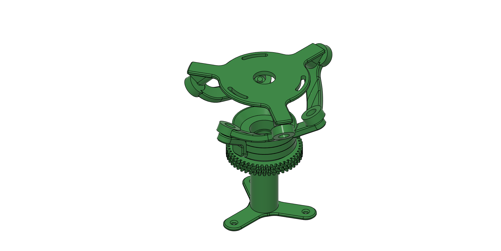{: style="height: 300px; display: block; margin: 0 auto;" }

=== "Real Print"
    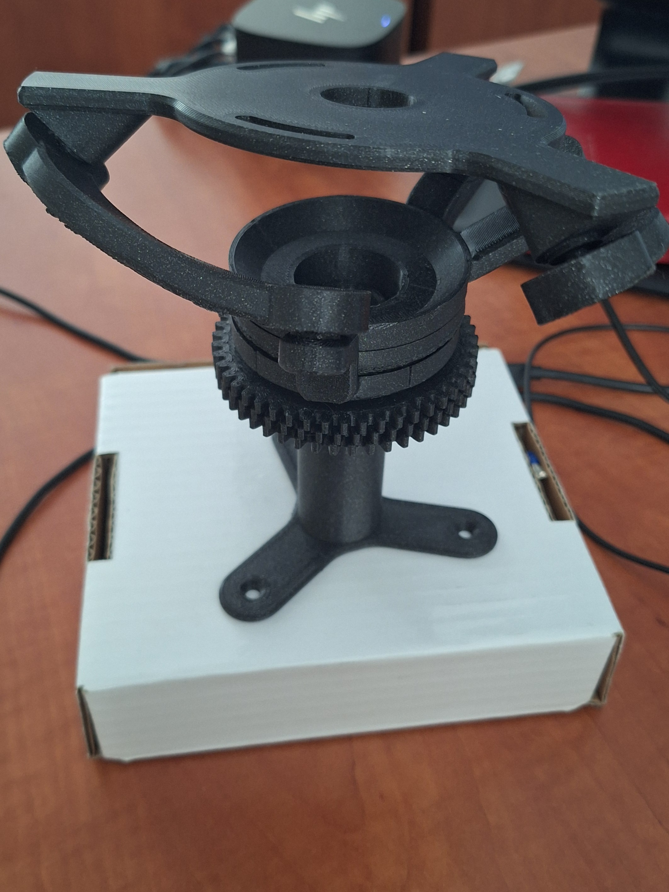{: style="height: 300px; display: block; margin: 0 auto;" }

**File Table (BOM):**

| Part | Qty | CAD File | Print File |
| :--- | :--- | :--- | :--- |
| **rsb-01_arm-axis** (Arm with bearing slot) | 3 pcs | [Download `.f3d`](3d_modeling_files/01_spm/cad/rsb-01_arm-axis-all.f3d) \| [Download `.step`](3d_modeling_files/01_spm/cad/rsb-01_arm-axis-all.step) | [Download `.3mf`](3d_modeling_files/01_spm/cad/rsb-01_arm-axis-all.3mf) |
| **rsb-01_top** (Top platform) | 1 pc | [Download `.f3d`](3d_modeling_files/01_spm/cad/rsb-01_top.f3d) \| [Download `.step`](3d_modeling_files/01_spm/cad/rsb-01_top.step) | [Download `.3mf`](3d_modeling_files/01_spm/cad/rsb-01_top.3mf) |
| **rsb-01_axis-main** (Bottom riser for motors) | 1 pc | [Download `.f3d`](3d_modeling_files/01_spm/cad/rsb-01_axis-main.f3d) \| [Download `.step`](3d_modeling_files/01_spm/cad/rsb-01_axis-main.step) | [Download `.3mf`](3d_modeling_files/01_spm/cad/rsb-01_axis-main.3mf) |
| **rsb-01_base-axis-01_gear_version** | 1 pc | [Download `.f3d`](3d_modeling_files/01_spm/cad/rsb-01_base-axis-01_gear_version.f3d) \| [Download `.step`](3d_modeling_files/01_spm/cad/rsb-01_base-axis-01_gear_version.step) | [Download `.3mf`](3d_modeling_files/01_spm/cad/rsb-01_base-axis-01_gear_version.3mf) |
| **rsb-01_base-axis-02_gear_version** | 1 pc | [Download `.f3d`](3d_modeling_files/01_spm/cad/rsb-01_base-axis-02_gear_version.f3d) \| [Download `.step`](3d_modeling_files/01_spm/cad/rsb-01_base-axis-02_gear_version.step) | [Download `.3mf`](3d_modeling_files/01_spm/cad/rsb-01_base-axis-02_gear_version.3mf) |
| **rsb-01_base-axis-03_gear_version** | 1 pc | [Download `.f3d`](3d_modeling_files/01_spm/cad/rsb-01_base-axis-03_gear_version.f3d) \| [Download `.step`](3d_modeling_files/01_spm/cad/rsb-01_base-axis-03_gear_version.step) | [Download `.3mf`](3d_modeling_files/01_spm/cad/rsb-01_base-axis-03_gear_version.3mf) |

---

## 2. GT2 Timing Belt Pulley Adapter (FL57STH76 Motor) `[CAD + 3D Print]`

A two-piece, side-bolted adapter designed to salvage chipped stepper motor shafts where the top was wider than the bottom.

!!! note "Model Development and Materials"
    The design went through many iterations. Ultimately, only the two-piece bolted version provided the required solid grip on the damaged shaft. Prototype in **PLA**; target **ABS / ASA**.

=== "CAD Visualization"
    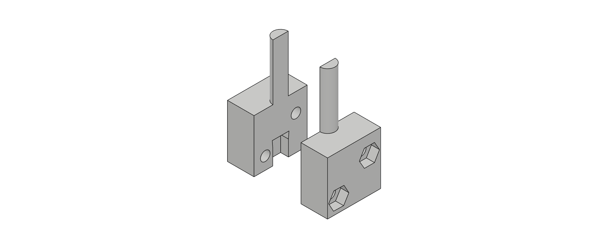{: style="height: 300px; display: block; margin: 0 auto;" }

=== "Real Print"
    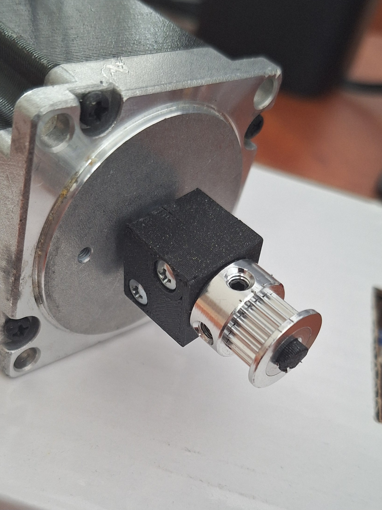{: style="height: 300px; display: block; margin: 0 auto;" }

**File Table (BOM):**

| Part | Qty | CAD File | Print File |
| :--- | :--- | :--- | :--- |
| **Bolted clamp adapter** | 1 pc | [Download `.f3d`](3d_modeling_files/02_adapter_fl57sth76_gt2/cad/fl57sth76_gt2_adapter.f3d) \| [Download `.step`](3d_modeling_files/02_adapter_fl57sth76_gt2/cad/fl57sth76_gt2_adapter.step) | [Download `.3mf`](3d_modeling_files/02_adapter_fl57sth76_gt2/cad/fl57sth76_gt2_adapter.3mf) |

---

## 3. Ethernet Port Mount with Protective Housing `[CAD + 3D Print]`

A mount allowing for stable soldering of an Ethernet jack to a universal prototyping board (perfboard). It sets the jack at the correct height and features positioning legs that fit into widened holes on the board.

!!! note "Model Development and Materials"
    Final version (second iteration after adjusting bottom hole dimensions). The element does not carry structural loads – made of **PLA**, target material indifferent.

=== "CAD Visualization"
    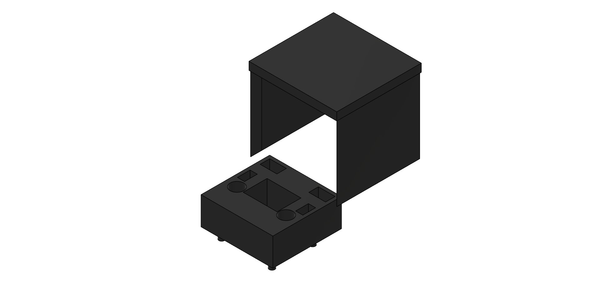{: style="height: 300px; display: block; margin: 0 auto;" }

=== "Real Print"
    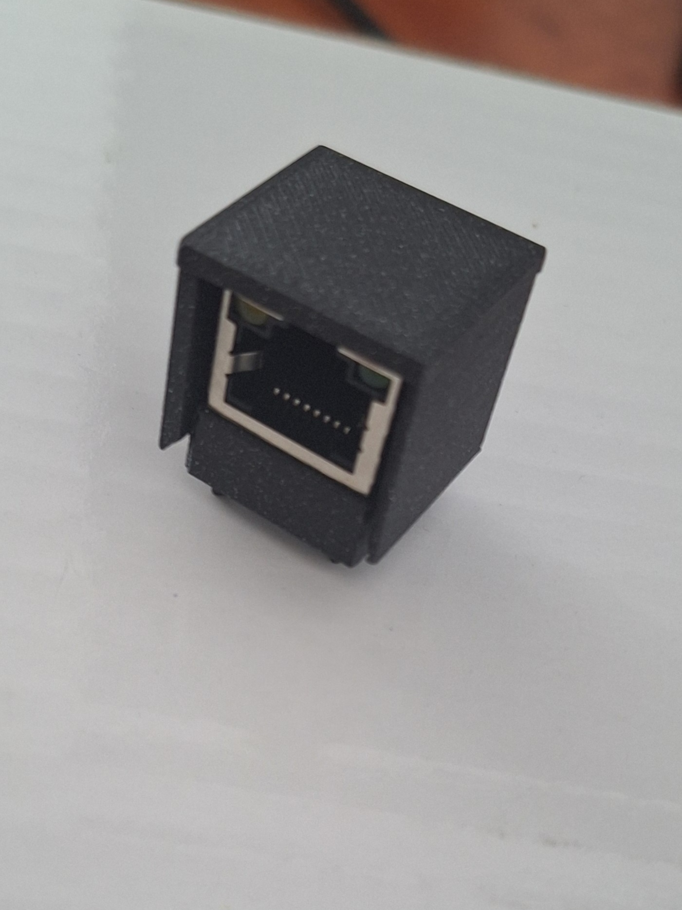{: style="height: 300px; display: block; margin: 0 auto;" }

**File Table (BOM):**

| Part | Qty | CAD File | Print File |
| :--- | :--- | :--- | :--- |
| **Positioning mount with Protective housing** | 1 pc | [Download `.f3d`](3d_modeling_files/03_eth_mount/cad/eth_mount.f3d) \| [Download `.step`](3d_modeling_files/03_eth_mount/cad/eth_mount.step) | [Download `.3mf`](3d_modeling_files/03_eth_mount/cad/eth_mount.3mf) |

---

## 4. Combo Mount (1x Ethernet + 2x USB) `[CAD + 3D Print]`

A development variant of the design from point 3, redesigned for a module with an Ethernet port and dual USB ports. The pin spacing and the height of the attachable housing were adjusted.

!!! note "Model Development and Materials"
    Successfully printed in the first iteration. Test material: **PLA**, target material: indifferent.

=== "CAD Visualization"
    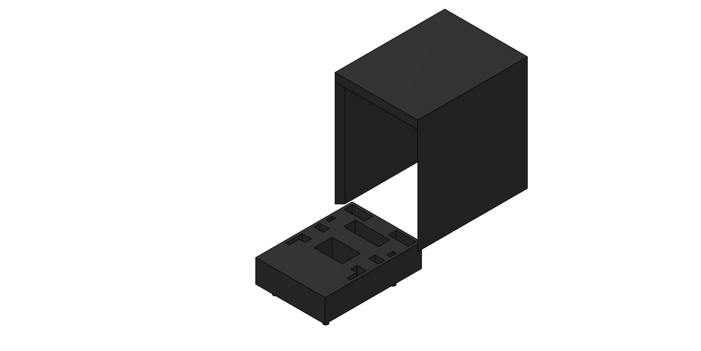{: style="height: 300px; display: block; margin: 0 auto;" }

=== "Real Print"
    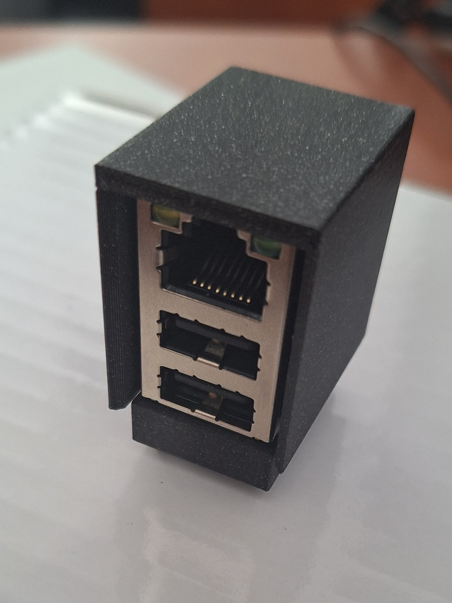{: style="height: 300px; display: block; margin: 0 auto;" }

**File Table (BOM):**

| Part | Qty | CAD File | Print File |
| :--- | :--- | :--- | :--- |
| **Combo connector mount with housing** | 1 pc | [Download `.f3d`](3d_modeling_files/04_eth_usb_mount/cad/eth_usb_mount.f3d) \| [Download `.step`](3d_modeling_files/04_eth_usb_mount/cad/eth_usb_mount.step) | [Download `.3mf`](3d_modeling_files/04_eth_usb_mount/cad/eth_usb_mount.3mf) |

---

## 5. XL4016 Module Mounting Base `[CAD + 3D Print]`

A simple positioning element. It features stabilizing pins that fit into the corner mounting holes of the XL4016 converter. The entire part is designed to be glued directly in place inside the device using hot melt adhesive.

!!! note "Model Development and Materials"
    Final version after correcting the mounting pin spacing. Material: **PLA**, target material: indifferent.

=== "CAD Visualization"
    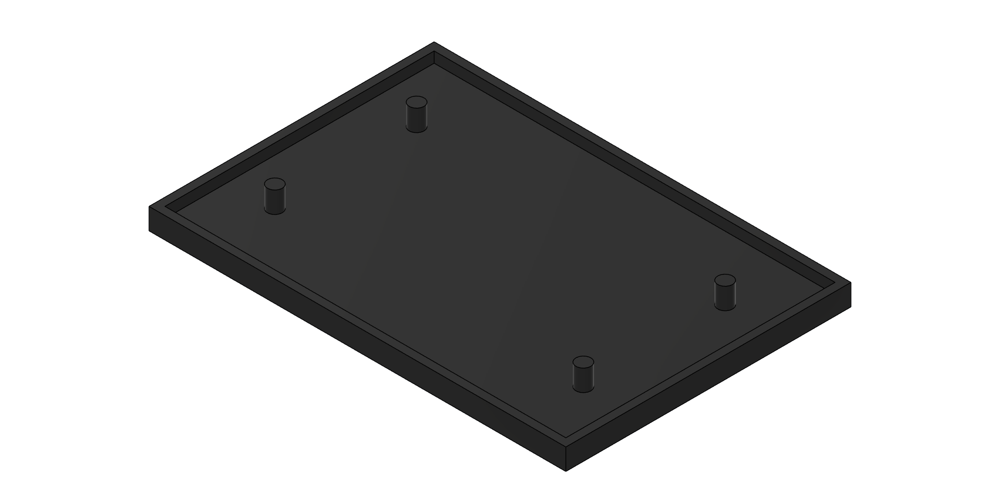{: style="height: 300px; display: block; margin: 0 auto;" }

=== "Real Print"
    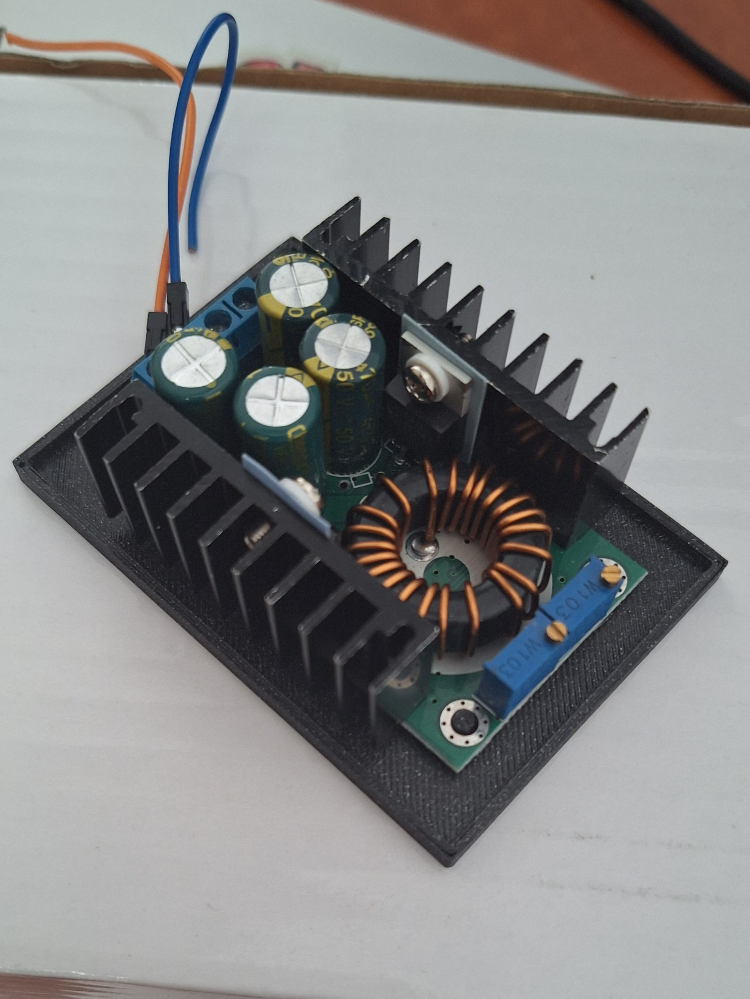{: style="height: 300px; display: block; margin: 0 auto;" }

**File Table (BOM):**

| Part | Qty | CAD File | Print File |
| :--- | :--- | :--- | :--- |
| **XL4016 Module Mounting Base** | 1 pc | [Download `.f3d`](3d_modeling_files/05_mounting_base_xl4016/cad/mounting_base_xl4016.f3d) \| [Download `.step`](3d_modeling_files/05_mounting_base_xl4016/cad/mounting_base_xl4016.step) | [Download `.3mf`](3d_modeling_files/05_mounting_base_xl4016/cad/mounting_base_xl4016.3mf) |

---

## 6. Expansion Platform for V-Slot Gantry `[CAD + 3D Print]`

A base expanding the workspace of the gantry carriage. Designed for mounting electronic components, the entire SPM mechanism, and attaching the Y-axis drive motor.

!!! note "Model Development and Materials"
    Working model, tested with **PLA**, however, due to carrying static loads of 3-5 kg, the target material is **ABS** or **ASA**. This element may undergo further modifications as the project evolves.

=== "CAD Visualization"
    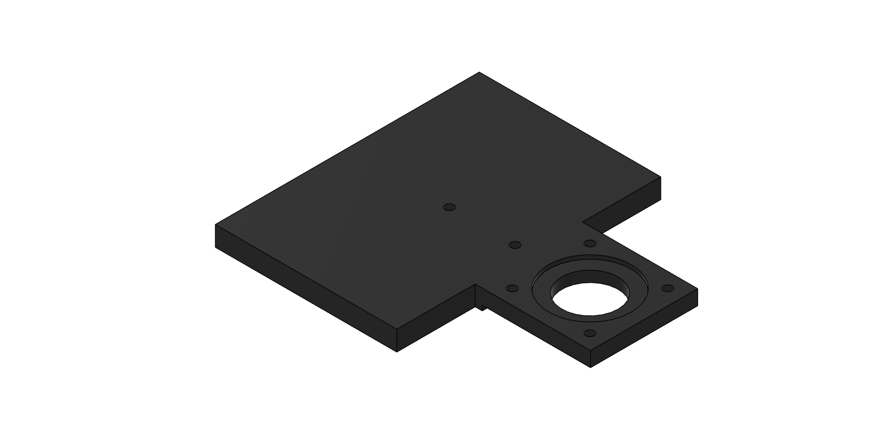{: style="height: 300px; display: block; margin: 0 auto;" }

=== "Real Print"
    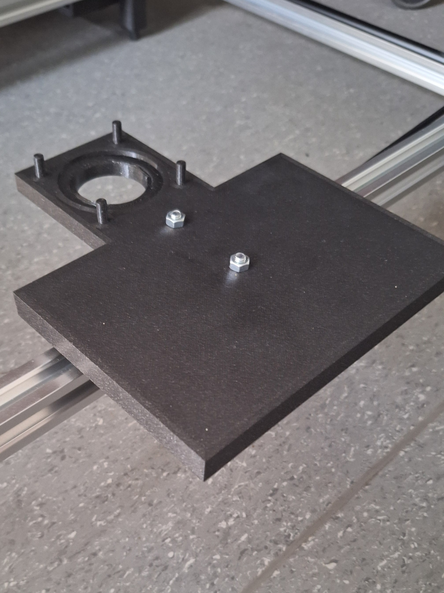{: style="height: 300px; display: block; margin: 0 auto;" }

* **Model files:** [Download `.f3d`](3d_modeling_files/06_expansion_platform_gantry/cad/expansion_platform_gantry.f3d) | [Download `.step`](3d_modeling_files/06_expansion_platform_gantry/cad/expansion_platform_gantry.step) | [Download `.3mf`](3d_modeling_files/06_expansion_platform_gantry/cad/expansion_platform_gantry.3mf)

---

## 7. Riser Feet for 2020 Profiles `[CAD + 3D Print]`

Modular risers for the cross table frame (CNC style). The core of the leg slides directly into the V-Slot profile, while the foot serves as a shock absorber and stabilizer.

!!! note "Model Development and Materials"
    Final version. A dual-material technological approach was used: the load-bearing core is printed from rigid **PLA**, and the foot contacting the ground from flexible **TPU**.

=== "CAD Visualization"
    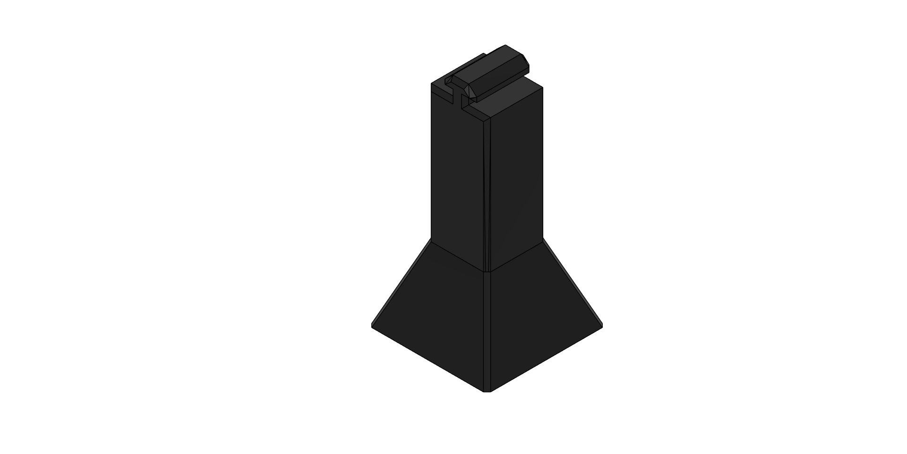{: style="height: 300px; display: block; margin: 0 auto;" }

=== "Real Print"
    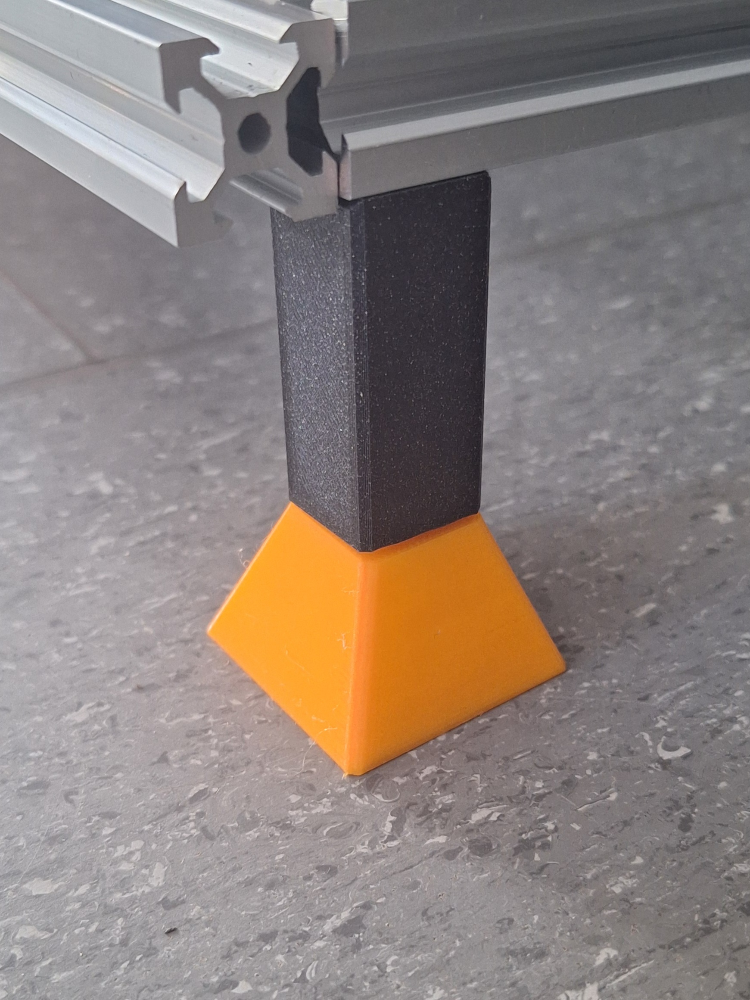{: style="height: 300px; display: block; margin: 0 auto;" }

**File Table (BOM):**

| Part | Material | CAD File | Print File |
| :--- | :--- | :--- | :--- |
| **Leg (45mm core)** | Rigid (PLA/ABS) | [Download `.f3d`](3d_modeling_files/07_riser_feet_2020/cad/riser_leg.f3d) \| [Download `.step`](3d_modeling_files/07_riser_feet_2020/cad/riser_leg.step) | [Download `.3mf`](3d_modeling_files/07_riser_feet_2020/cad/riser_leg.3mf) |
| **Expanding foot** | Flexible (TPU) | [Download `.f3d`](3d_modeling_files/07_riser_feet_2020/cad/expanding_foot.f3d) \| [Download `.step`](3d_modeling_files/07_riser_feet_2020/cad/expanding_foot.step) | [Download `.3mf`](3d_modeling_files/07_riser_feet_2020/cad/expanding_foot.3mf) |

---

## 8. Mount and Gear for JK42HS34 Motor `[CAD + 3D Print]`

A mounting assembly allowing a drive element to be seated on a round motor shaft. Due to the risk of slipping, the mount consists of two bolted halves that form a square top profile, onto which a gear with a matching square bore is mounted to ensure positive engagement.

!!! note "Model Development and Materials"
    Model in the testing phase, awaiting stress tests. Recommended print materials: target **ABS / ASA**.

=== "CAD Visualization"
    {: style="height: 300px; display: block; margin: 0 auto;" }
=== "Real Print"
    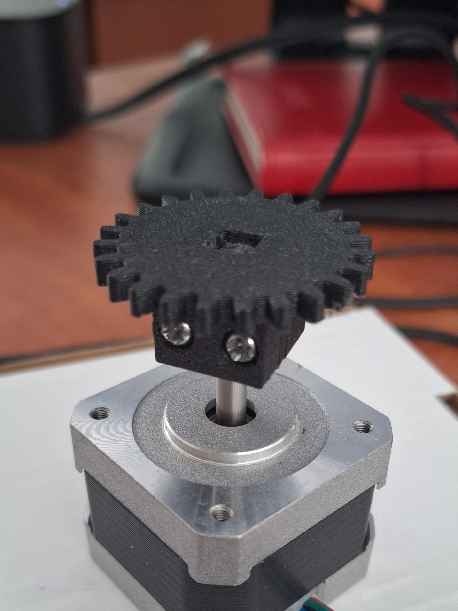{: style="height: 300px; display: block; margin: 0 auto;" }

**File Table (BOM):**

| Part | Qty | CAD File | Print File |
| :--- | :--- | :--- | :--- |
| **Bolted clamp (A + B)** | Set | [Download `.f3d`](3d_modeling_files/08_mount_gear_jk42hs34/cad/bolted_clamp.f3d) \| [Download `.step`](3d_modeling_files/08_mount_gear_jk42hs34/cad/bolted_clamp.step) | [Download `.3mf`](3d_modeling_files/08_mount_gear_jk42hs34/cad/bolted_clamp.3mf) |
| **Gear (square profile)** | 1 pc | [Download `.f3d`](3d_modeling_files/08_mount_gear_jk42hs34/cad/gear.f3d) \| [Download `.step`](3d_modeling_files/08_mount_gear_jk42hs34/cad/gear.step) | [Download `.3mf`](3d_modeling_files/08_mount_gear_jk42hs34/cad/gear.3mf) |

---

## 9. FL57STH76 Motor Mount for V-Slot Frame `[CAD + 3D Print]`

A load-bearing element that allows the X-axis motor to be inserted, bolted, and precisely height-positioned directly to the V-Slot profiles using standard M5 screws.

!!! note "Model Development and Materials"
    Model in the testing phase, awaiting stress tests. Recommended print materials: target **ABS / ASA**.

=== "CAD Visualization"
    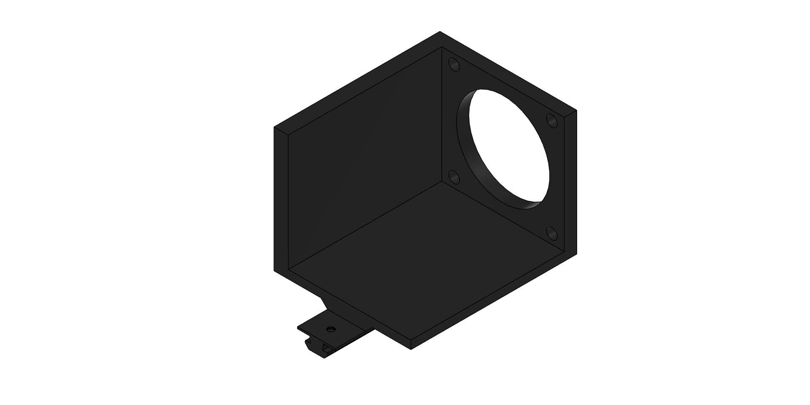{: style="height: 300px; display: block; margin: 0 auto;" }
=== "Real Print"
    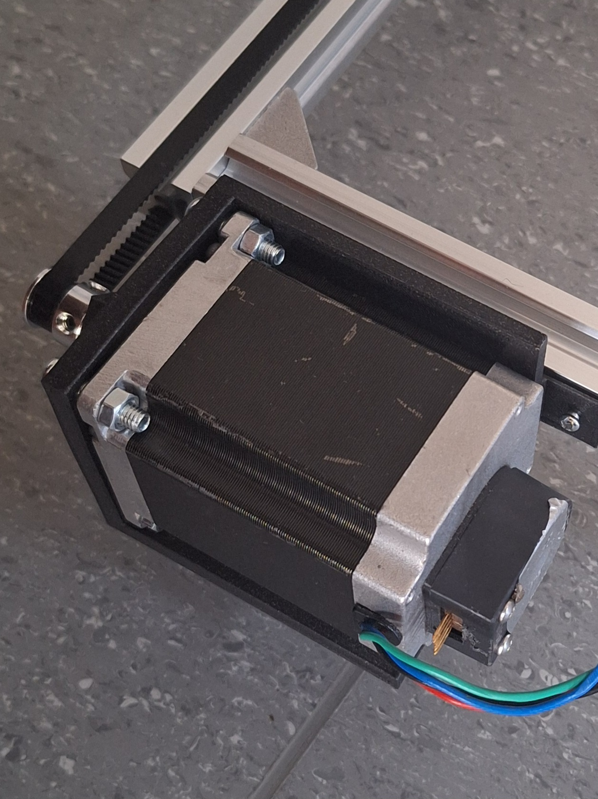{: style="height: 300px; display: block; margin: 0 auto;" }

**File Table (BOM):**

| Part | Qty | CAD File | Print File |
| :--- | :--- | :--- | :--- |
| **Model files:** | 1 pc | [Download `.f3d`](3d_modeling_files/09_fl57sth76_mount_vslot_frame/cad/fl57sth76_vslot_mount.f3d) \| [Download `.step`](3d_modeling_files/09_fl57sth76_mount_vslot_frame/cad/fl57sth76_vslot_mount.step) | [Download `.3mf`](3d_modeling_files/09_fl57sth76_mount_vslot_frame/cad/fl57sth76_vslot_mount.3mf)|

---

## 10. "Sar Brage" Ship Hull (5DoF Mockup) `[CAD Only]`

The main body constituting the outer shell of the land mockup, stripped of cosmetic elements (railings, antennas). The interior is designed to be completely hollow, creating a chamber for electronic systems (the design does not assume submerging in water; it is strictly a kinetic display element). 

!!! note "Model Development and Materials"
    Model in development. It was modeled in a universal scale based on millimeter units – the target size and proportions (scaling) are set directly in the slicer environment before printing. Proposed material: **PLA**.

=== "CAD Visualization"
    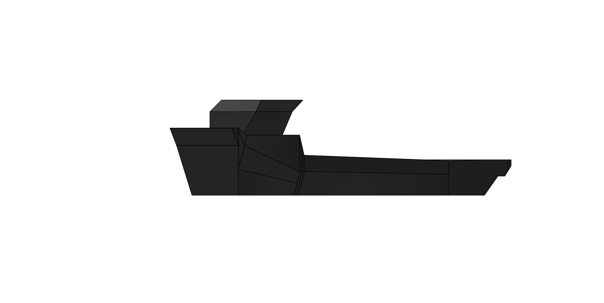{: style="height: 300px; display: block; margin: 0 auto;" }
    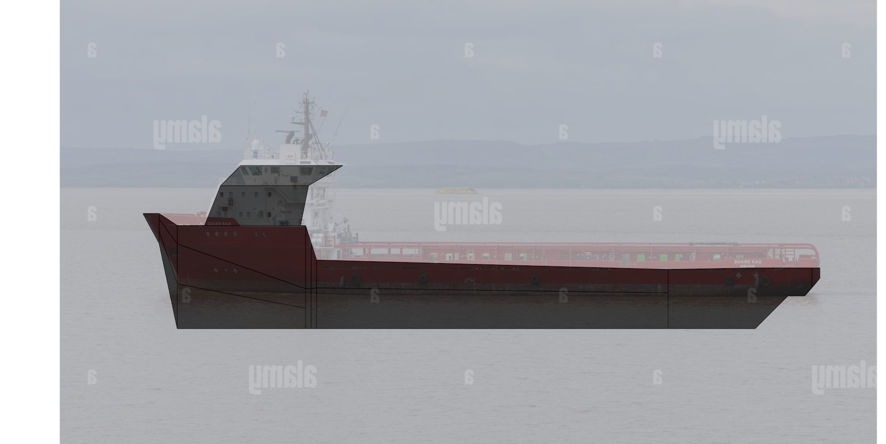{: style="height: 300px; display: block; margin: 0 auto;" }
| Part | Qty | CAD File | Print File |
| :--- | :--- | :--- | :--- |
| **Model files:** | 1 pc | [Download `.f3d`](3d_modeling_files/10_sar_brage_hull/cad/sar_brage.f3d) \| [Download `.step`](3d_modeling_files/10_sar_brage_hull/cad/sar_brage.step) | [Download `.3mf`](3d_modeling_files/10_sar_brage_hull/cad/sar_brage.3mf)|

## 11. V-Slot 2020 Corner Bracket `[CAD + 3D Print]`

A 90-degree corner connector designed for joining **V-Slot 2020 aluminum profiles**. The printed brackets were used to reinforce the frame because the previously installed metal corner brackets tended to rotate under load, causing the structure to wobble. The printed bracket provides a larger contact area against the profiles and helps maintain the correct angle between them.

!!! info "Model Origin and License (CC0 1.0 — Public Domain)"
    This element is based on the original project **"Vslot 20x20 corner bracket"** by **Guy St (@GuySt_280873)**, downloaded from [Printables](https://www.printables.com/model/638405-vslot-20x20-corner-bracket){ target="_blank" rel="noopener noreferrer" }.

    The original model was released under the [CC0 1.0 Universal — Public Domain Dedication](https://creativecommons.org/publicdomain/zero/1.0/) The CC0 dedication permits the model to be copied, modified, distributed, and used for both private and commercial purposes without requiring permission. Attribution is not legally required; however, the original author and source are included here as a matter of good documentation practice.

=== "CAD Visualization"
    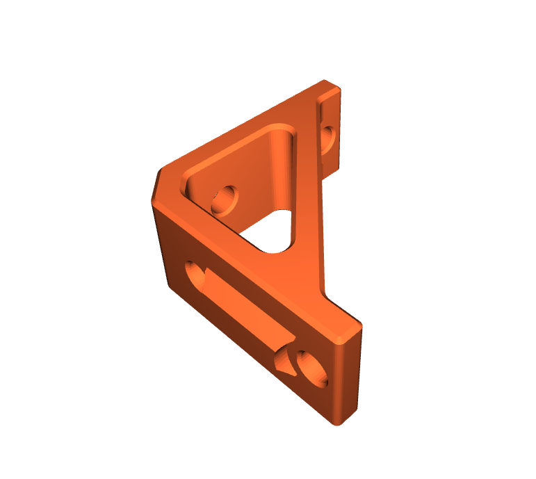{: style="height: 300px; display: block; margin: 0 auto;" }

=== "Real Print"
    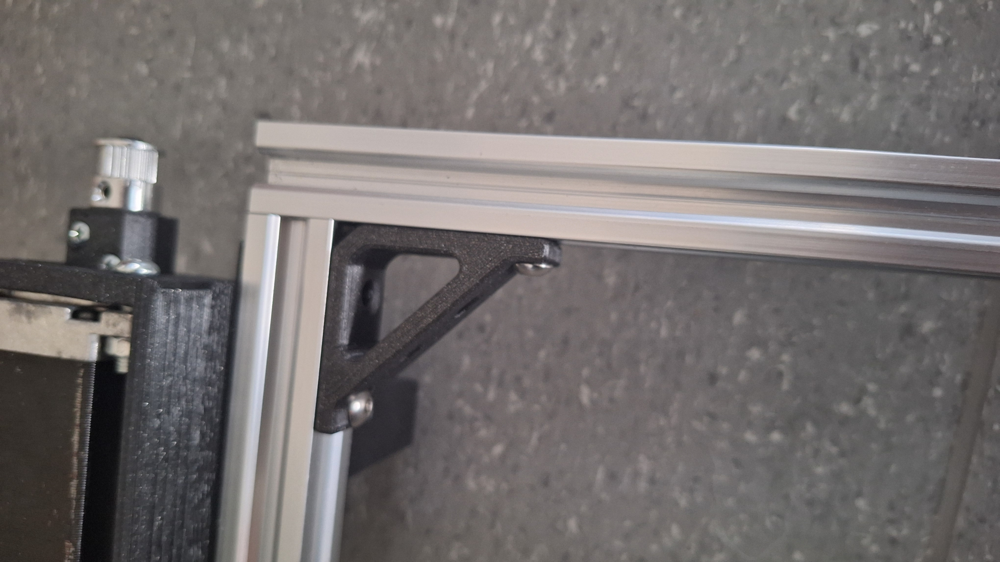{: style="height: 300px; display: block; margin: 0 auto;" }

| Part | Qty | CAD File |
| :--- | :--- | :--- |
| **Model files:** | 4 pc | [Download `.step`](3d_modeling_files/11_vslot_corner_bracket/cad/45Bracket_.step)