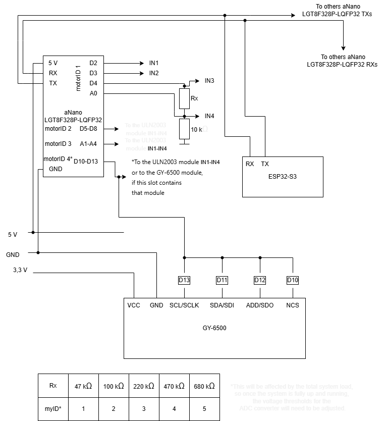
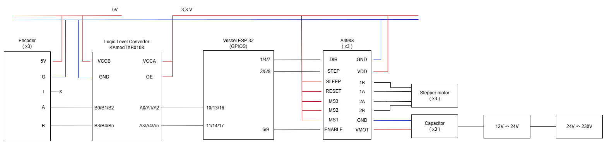

# Hardware

## Vessel ESP 32 S3 Pico
The Vessel ESP32-S3 Pico is the main controller responsible for controlling the vessel motion platform and communicating with the thruster controller.

### GPIO configuration:

- **GPIO 0 and 33** – button inputs;
- **GPIO 1, 4, and 8** – step pulse outputs for the surge and sway motors;
- **GPIO 2, 5, and 7** – direction control outputs for the surge and sway motors; 
- **GPIO 6 and 9** – enable outputs for the surge and sway A4988 stepper motor drivers;
- **GPIO 10, 11, 13, 14, 16, and 17** – encoder A/B channel inputs for the surge and sway motors;
- **GPIO 12, 15, and 18** – limit switch inputs for the surge and sway axes;
- **GPIO 34, 37, and 39** – step pulse outputs for the spherical parallel manipulator motors;
- **GPIO 35, 38, and 40** – direction control outputs for the spherical parallel manipulator motors;
- **GPIO 36** – enable output for the spherical parallel manipulator A4988 stepper motor drivers;
- **GPIO 41 and 42** – UART communication with the Arduino Nano.

## Control panel ESP 32
Acquisition of data from server

ESP-NOW communication

Access point

## Arduino Nano
The Arduino Nano controls the vessel thrusters. It receives commands from the Vessel ESP32 over UART and converts them into the control signals required by the individual thrusters.

The 5 V comes from the voltage converter.

*The specific IDs are derived from the voltage measured when the application program runs on the microcontroller; while this level may fluctuate depending on the circuit's load, the IDs were assigned reasonably accurately at the time of implementation.

When the microcontroller supports an MPU module (only when its ID is equal to one), it simultaneously has fewer pins available for driving stepper motors because the MPU communicates via SPI, which requires more wiring; however, the advantage is rapid data transmission and processing.

## Surge and sway motors
Surge and sway motion is provided by three identical stepper motors:

 - two motors control motion along the X-axis;
 - one motor controls motion along the Y-axis.

Motors parameters:

 - **Voltage:** 12 V
 - **Current:** 0.74 A
 - **Step angle:** 1.8°

Because the stepper motors can lose steps during operation, encoders are used to measure the actual motor position. The controller compares the measured position with the commanded position and applies a correction when a positioning error is detected.

All encoders are the same model: **E2-200-250-NE-H-D-B**.

### Instalation:

## Heading, pitch and roll motors
Heading, pitch, and roll motion is provided by three identical [stepper motors](https://allegro.pl/produkt/jk42hs34-0404-silnik-krokowy-nema17-12v-2-6kg-cm-ae85d7b0-26fc-4650-ab60-a74a4b44aa1c?offerId=18301714312).

Motors parameters:

 - **Voltage:** 12 V
 - **Current:** 0.4 A
 - **Step angle:** 1.8°

## Thrusters

The vessel is equipped with five thrusters:
 
 - one bow thruster;
 - four azimuth thrusters.
 
 The thrusters are controlled by the Arduino Nano, which receives commands from the Vessel ESP32 through a UART connection.