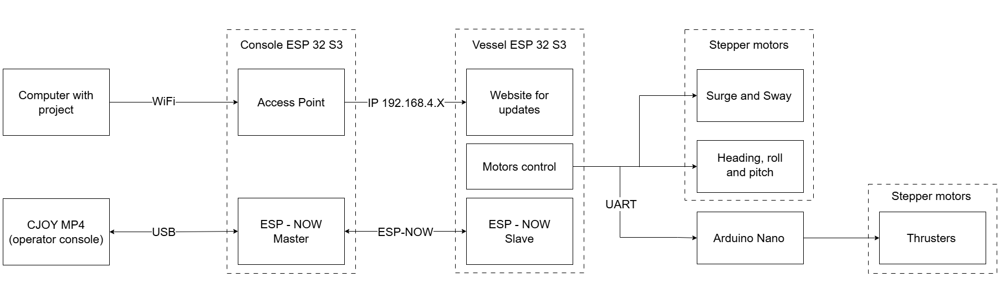

# Overview

This project provides a platform for controlling and simulating vessel motion in five degrees of freedom (5 DOF). The vessel can be controlled either manually using a joystick or automatically by specifying target coordinates and orientation parameters.

!!! warning "Introduction"
    For a broader understanding of how program algorithms work using a state machine, see [State space](state_space.md).

The operator can:

 - [x] configure the platform workspace dimensions;
 - [ ] define target coordinates for the vessel to reach and maintain;
 - [x] manually control vessel movements using a joystick;
 - [ ] simulate vessel motion caused by waves;
 - [x] monitor the current vessel position;
 - [x] monitor thruster positions and load conditions.

## Surge and sway
Surge and sway motion are achieved using two electric motors for the X-axis and one electric motor for the Y-axis. Each motor is equipped with an encoder to ensure precise positioning and accurate movement to the desired coordinates.

The motion system is controlled by an ESP32-S3 Pico microcontroller, hereafter referred to as the **Vessel ESP32**, together with A4988 stepper motor drivers.

For additional information, see the [Hardware](hardware.md) and [Software](software.md) sections.

## Heading, pitch and roll
Heading, pitch, and roll motions are accomplished using a Spherical Parallel Manipulator based on the [Sphericall Parallel Base](https://www.printables.com/model/894231-spherical-parallel-base). 

The manipulator is driven by three stepper motors controlled by the Vessel ESP32 through A4988 stepper motor drivers.

For additional information, see the [Hardware](hardware.md) and [Software](software.md) sections.

## Thrusters
The vessel is equipped with five thrusters: one bow thruster and four azimuth thrusters.

They are controlled by Arduino Nano which is taking orders from Vessel ESP32

For additional information, see the [Hardware](hardware.md) and [Software](software.md) sections.

## Control panel
The control panel provides the user interface for vessel operation, system monitoring, and configuration.

For additional information, see the [Hardware](hardware.md) and [Software](software.md) sections.

## Communication

The system utilizes several communication methods:

 - [ESP-NOW](software.md#esp-now)
 - [Wi-Fi](software.md#wifi)
 - [UART](software.md#uart)

Each communication channel is used for specific subsystems and data exchange requirements within the platform.

## Over the air updates
Firmware updates can be performed over the air (OTA). To initiate an update, connect to the access point hosted by the ESP32 controller and open the update web interface in a browser.

For detailed instructions, see the [Over-the-Air Updates](software.md#over-the-air-updates) section.