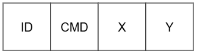

# Software

## Surge and sway
Movement in surge and sway directions is calculated using Bresenham algorithm located in file: **hello_world/main/Move_XY/bresenham.c**. Position is acquired from encoders which are located on every stepper motor.

## Heading, pitch and roll
Spherical Parallel Manipulator

**spm_ik.c/h**: Computes inverse kinematics for the platform. Given desired roll, pitch, and heading angles in degrees, this module calculates the three joint angles (theta1–theta3) required to position the platform's end-effector. It generates a 3×3 rotation matrix from the input angles, then iteratively solves for each motor angle using trigonometric equations with clamped inverse cosine for numerical stability.

**spm_motors.c/h**: Manages three stepper motors using FreeRTOS task-based control. Commands are queued for asynchronous execution, allowing non-blocking motor movements. The module implements Bresenham-style synchronized stepping to control three motors with fractional distribution, tracks actual and target positions in step counts, and provides a high-level interface (`spm_motors_move_rpy()`) that integrates the IK solver with motor control.

## Communication

### Topology

### ESP-NOW
Available commands:

**For Console ESP32:**

 - CMD_SET_FIELD_DIMENSIONS (1)
 - CMD_GET_POSITION (2)
 - CMD_SET_MOVE_TO (3)
 - CMD_SET_MOVE_BY (4)

**For Vessel ESP32:** 

 - CMD_POSITION_RESPONSE (5)
 - CMD_ACK_POSITION (6)

 Command structure:

    
    ID is message id set by console
    CMD is command number from 1 to 6
    X is position on North-South axis
    Y is position on East-West axis

### Wi-Fi
Access Point is hosted on Console ESP32. On start of **hello_world/main/config_access_point.c** file, on esp_now_config branch, there is possibility to set AP name: **WIFI_SSID_NAME** and password **WIFI_PASS**.
 
### UART
UART communication is utelized in two scenarios:

 - communication between operator console and Console ESP32
 - communication between Vessel ESP32 and Arduino Nano

## Thrusters, gyroscope and accelerometer
The system is designed around three key concepts commonly used in robotics, aerospace, and motion control systems: thrusters, gyroscopes, and accelerometers.

**commands.h**: Defines the protocol constants and frame structure for UART communication. Contains 16-bit command codes (ping, status, motor control, sensor telemetry) and the packed UARTFrame structure consisting of preamble, board ID, command, motor ID, four 16-bit data fields, and an XOR checksum.

**thrusters_control.c/h**: Provides high-level wrapper functions for sending thruster commands (homing, absolute/relative movement, velocity control, speed/acceleration configuration) and sensor queries (live/historical MPU and gyro data, push events). Each function marshals its arguments and calls `uart_send_frame()` with the appropriate command code.

**uart_comm.c/h**: Implements the low-level UART driver, frame transmission, and telemetry collection. Features include CRC verification, send/receive timeout management with state tracking, automatic response-based flow control, and a background FreeRTOS task that periodically chains telemetry requests (CMD_LIVE_MPU → CMD_HIST_MPU → CMD_LIVE_GYRO → CMD_HIST_GYRO → CMD_PUSH_INFO) to gather sensor data from the Arduino Nano into a shared TelemetryData structure.

### Thrusters
Thrusters are actuators that generate force or torque to change the position or orientation of a vehicle. In this project, physical rocket thrusters are represented by stepper motors, which can be commanded to move to a position, rotate continuously at a given velocity, or stop. By controlling the motors independently, the system can simulate attitude and motion control similar to that used in satellites or spacecraft.

### Gyroscope
The MPU6500 gyroscope measures angular velocity around the three axes:

- GX – rotation around the X-axis (roll rate)
- GY – rotation around the Y-axis (pitch rate)
- GZ – rotation around the Z-axis (yaw rate)

The firmware continuously reads the gyroscope and stores both current and peak rotational rates. These measurements provide information about how quickly the system is rotating and are useful for stability monitoring and control algorithms.

### Accelerometer
The MPU6500 accelerometer measures acceleration along the X, Y, and Z axes. Using the measured acceleration components, the firmware calculates:

- Pitch angle
- Roll angle
- Dynamic acceleration (Dynamic G)

Pitch and roll are estimated from the gravity vector when the device is stationary or moving slowly. The magnitude of dynamic acceleration is also used to detect motion events ("pushes") and track the highest acceleration experienced by the system.

### Sensor Monitoring
The firmware maintains both real-time and historical sensor data, including:

- Current pitch and roll angles
- Peak pitch and roll values
- Current gyroscope rates (GX, GY, GZ)
- Peak gyroscope rates
- Maximum dynamic acceleration
- Motion event counter (pushCount)

## Over the air updates
There is possiblity to upload new firmware for Vessel ESP 32 S3 Pico controller using WiFi.

First it is required to have both ESP 32 controllers ON. Vessel controler will automaticlly connect to Console controller's access point based on provided MAC adress. If it is not known, there is possiblity to check it using commented part of code in main.c file.

If controllers are connected with each other operator has to connect to access point with AP name and password provided in file.

When succesfully connected operator can open website which is under IP adress of Vessel controller (192.168.1.2 if it is the first device connected to AP).

On the website there is button "Wybierz plik" which allows to choose firmware to be uploaded. In order to get firmware from the project operator has to build project (idf.py build), than navigate to project_name -> build and find file named: project_name.bin. After choosing the file operator can send it using "Prześlij" button.

When succesfully downloaded, file will be placed into partition and controller will reboot.

