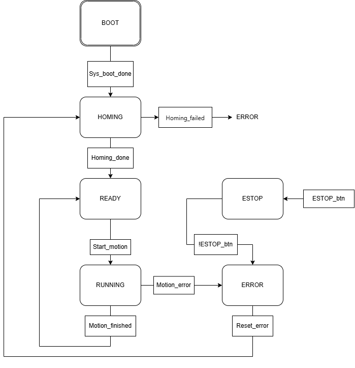

# State_space




## Overview

The KM-2026 is an autonomous marine vessel control system centered around three core subsystems: (1) XY-axis motion using synchronized stepper motors with Bresenham stepping and encoder feedback for surge/sway positioning, (2) SPM (Spherical Parallel Manipulator) with three-axis inverse kinematics for precise heading/pitch/roll platform orientation, and (3) Thrusters + IMU telemetry providing real-time gyroscope/accelerometer feedback from an Arduino Nano via UART. A centralized finite state machine (BOOT → HOMING → READY → RUNNING → ERROR/E-STOP) orchestrates all motion commands and sensor integration, running every 10 ms under FreeRTOS. Communication occurs through ESP-NOW for inter-ESP32 wireless commands, WiFi for OTA firmware updates and network access, and UART for thruster/sensor polling. The system prioritizes emergency stop above all states—any time the E-STOP button is pressed, all motors halt immediately and re-homing is required before normal operation resumes.

## SYSTEM_BOOT​
System startup state. 
During this phase, all necessary modules are initialized, hardware is configured, and the device is prepared for operation. 
Upon successful completion of the startup process, the system automatically transitions to the homing state (SYSTEM_HOMING).

## SYSTEM_HOMING​
The state responsible for the axis homing procedure. 
Its purpose is to determine the reference position of the drives so that subsequent movements can be executed with the required accuracy. 
If the homing process completes successfully, the system transitions to the ready state (SYSTEM_READY); 
in the event of an error, it transitions to the error state (SYSTEM_ERROR).

## SYSTEM_READY​
Operational readiness state. 
In this state, the system performs no movements and awaits a new control command via by esp-now and mpu data from arduino by UART protocol. 
This is the primary operating state in which the device remains for the majority of the time. 
Upon receipt of a valid command, the system transitions to the task execution state (SYSTEM_RUNNING).

## SYSTEM_RUNNING​
Execution status of the current command. 
The system executes the received command, such as moving to a specified position, performing a relative movement, or controlling the SPM platform using roll, pitch, and yaw parameters.
This is where the UART commands to be sent to various Arduino boards should go, depending on the motors we want to control. 
Upon successful completion of the task, the system returns to the ready state (SYSTEM_READY), whereas if an error occurs, it transitions to the error state (SYSTEM_ERROR).

## SYSTEM_ERROR​
Error handling state. 
It occurs when an anomaly is detected during system operation. 
Once the cause of the error is resolved and a reset is performed, the system returns to the (SYSTEM_HOMING) state, allowing the reference position of the drives to be re-established before operation resumes.

## SYSTEM_EMERGENCY_STOP​
Emergency stop (E-STOP) state. 
Activated by the safety button, this state immediately stops all motion and interrupts ongoing operations. 
After the emergency stop condition is released, the system enters SYSTEM_ERROR, where operator acknowledgment is required. 
Once the error is reset, the system performs the homing procedure before returning to normal operation.

## Code overview
The system is implemented as a finite state machine (FSM) executed by the `system_state_task()` FreeRTOS task. The task continuously monitors the current system state and calls the corresponding state handler. State transitions are performed using the `system_set_state()` function, while motion requests are delivered through the command interface implemented by `system_set_command()`.

### 1. System Startup
The state machine begins in the `SYSTEM_BOOT` state: `static system_state_t current_state = SYSTEM_BOOT`;
During this stage, the `system_boot_handler()` function executes the system initialization sequence by calling: `system_boot()`;
After successful initialization, the system transitions to the homing procedure: `system_set_state(SYSTEM_HOMING)`;

### 2. Homing Procedure
In the `SYSTEM_HOMING` state, the `system_homing_handler()` function performs the drive homing operation: `bool homing_done = motor_homing()`;
If homing is completed successfully, the system enters the operational readiness state: `system_set_state(SYSTEM_READY)`;
If homing fails, the system transitions to the error state: `system_set_state(SYSTEM_ERROR)`;

### 3. Waiting for Commands
While in the `SYSTEM_READY` state, the system remains idle and waits for incoming motion requests. 
New commands are accepted through the `system_set_command()` interface.

`system_set_command(&cmd);`

This function stores the received command in the `pending_command` structure and sets the `command_pending` flag.
```c
pending_command = *cmd;
command_pending = true;
```
Once a pending command is detected, the state machine transitions to: `SYSTEM_RUNNING`.

### 4. Command Execution
The `SYSTEM_RUNNING` state is responsible for executing the command stored in `pending_command`.

Depending on the command type, the system calls one of the motion control functions:

Absolute Positioning: `motor_move_to(x, y)`;
Executed when: `ACTION_MOVE_TO`
is received.

Relative Positioning: `motor_move_by(x, y)`;
Executed when: `ACTION_MOVE_BY`
is received.

SPM Orientation Control: 
```c
spm_motors_move_rpy(
    roll,
    pitch,
    yaw,
    0.5f);
```
Executed when: `ACTION_SPM`
is received.

After the command has been processed, the pending flag is cleared and the command buffer is reset.
```c
command_pending = false;
pending_command.action = ACTION_NONE;
```
If execution succeeds, the system returns to: `SYSTEM_READY`
Otherwise, it transitions to: `SYSTEM_ERROR`

### 5. Error Handling
Whenever a fault is detected during homing or motion execution, the state machine enters the `SYSTEM_ERROR` state.

The `system_error_handler()` function continuously checks whether the error condition has been cleared through: `error_reset()`;

Once the reset condition is satisfied, the state machine leaves the error state and continues according to the transition logic defined for the project.

This mechanism prevents further motion commands from being executed while the system is in a fault condition.

### 6. Emergency Stop Handling
The emergency stop function has the highest priority in the entire state machine.

During every iteration of `system_state_task()`, the emergency stop input is checked before executing any state handler:

```c
if (is_emergency_stop_pressed())
{
    system_set_state(SYSTEM_EMERGENCY_STOP);
}
```
When the emergency stop is activated, `motor_emergency_stop()` is executed immediately to stop all motion and interrupt ongoing operations.

The system remains in the `SYSTEM_EMERGENCY_STOP` state as long as the emergency stop condition is active. 
Once the emergency stop button is released, the system transitions to the `SYSTEM_ERROR` state. 
This ensures that the operator must explicitly acknowledge the event through the error reset procedure before operation can continue.

After the error has been reset, the system proceeds to the `SYSTEM_HOMING` state to re-establish the reference position of the drives.
Normal operation can resume only after the homing procedure has been completed successfully.

### 7. Continuous State Machine Execution
The entire state machine operates inside an infinite loop driven by FreeRTOS:
```c
while (1)
{
    ...
    vTaskDelay(pdMS_TO_TICKS(10));
}
```
The loop executes every 10 ms, ensuring periodic monitoring of system status, command processing, fault detection, and emergency stop handling. 
This architecture provides deterministic and centralized control of all operational modes of the system.