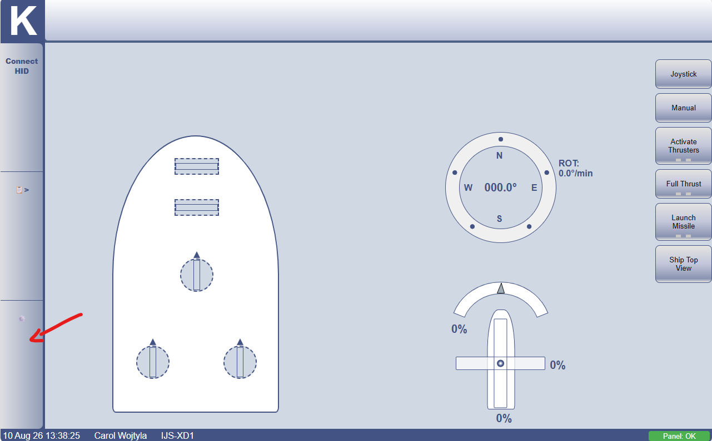
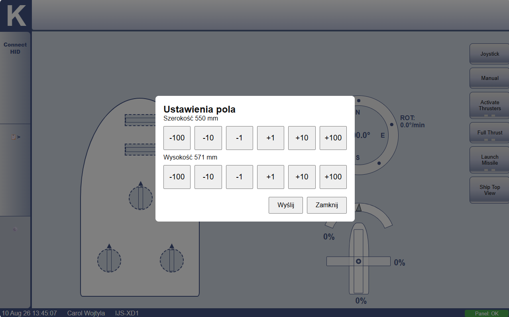

# User guide

## Running the system
The system can be started simply by running the `ships.exe` executable. If `config.json` file is not present in the same directory as the executable, the system will create a default `config.json` file with default settings. The system will then start and initialize all components. Once the system is started, the panel webpage should be opened automatically in the Edge browser. Additionally, panel can be accessed at `localhost:3000`.

**Note:** Panel port: 3000 can be changed in the `config.json` file. If the port is changed, the panel can be accessed at `localhost:<port>`.

## Development

Initial project was developed using [Bun](https://bun.sh/) runtime, version 1.3.14. 

### Running the project in development mode
To run the project in development mode, run the following command in the project root directory
```cmd
bun run start
```
### Building the project
**Important:** If build target is cJoy, Bun runtime must be in **baseline** version. The default Bun version uses a different instruction set, which is not compatible with old cJoy processor.

To build the project, run the following command in the project root directory
```cmd
bun build --compile .\src\backend\index.ts --outfile ships.exe
```

**Note:** `bun run build` command was defined to run the above command, but during development, it was found that the command is not working properly, even though it run the same command. Therefore, it is recommended to run the above command directly. Maybe fresh Bun installation with baseline build will fix the issue, but it was not tested.


## Setting workspace dimmensions
Workspace dimensions can be set in the `config.json` file. The workspace is defined by the x,y coordinates defined in milimeters.
config.json default values for workspace dimensions are:
```json
  "settings": {
    "fieldDimensions": {
      "width": 550,
      "height": 550
    }
```
Provided values are used to initialize field dimensions during system startup. Additionaly, field dimensions can be set at runtime:



Tapping the "Send"(Wyślij) button will send the new dimensions to the server, which will then update the field dimensions in the system.
Closing the settings panel will discard any changes made to the field dimensions.



**Note:** Sent values at runtime **won't** be saved to the `config.json` file, and will be lost after system restart. To make changes permanent, edit the `config.json` file directly.

## Manually controlling vessel

### Joystick/HID device control
Currently, the vessel can be controlled manually using the Gamepad/HID device. If using a HID (default and recommended for cJoy), a device must be paired with the system. Pairing can be done via the "Connect HID" button in the side panel. Once paired, the device can be used to control the vessel.

### Activate Thrusters
At startup readings from the all motion sources won't be forwarded to the thruster controller until the "Activate Thrusters" button is activated. This is to prevent the vessel from moving unexpectedly when the system is started and the user is not ready to control it. Once the "Activate Thrusters" button is activated, the vessel will respond to the motion sources and can be controlled. Once the "Activate Thrusters" button is deactivated, the vessel will stop responding to the motion sources and will set the thrusters to initial position. The "Activate Thrusters" button can be activated and deactivated at any time during operation.

### Full Thrust
By default, the vessel operates in Reduced Thrust mode, which limits the maximum speed of the vessel to 33% in each direction. To switch to Full Thrust mode, double tap the "Full Thrust" button. Once activated, the vessel will operate at full speed in each direction. To switch back to Reduced Thrust mode, double tap the "Full Thrust" button again.

### Control modes
The "Joystick" and "Manual" buttons can be used to switch between control modes. Only one control mode can be active at a time. The "Joystick" button activates the Joystick control mode, which allows the user to control the vessel using a HID device. The "Manual" button activates the Manual control mode, which allows the user to control the vessel using the on-screen controls.

**Important**: The panel **won't** forward any Motion Command to the server unless the desired control mode is active. For example, if the "Joystick" control mode is not active, the panel won't forward any Motion Command generated by the Joystick/HID device to the server. 


### Setting position to reach and maintain
This control mode is currently not implemented. 